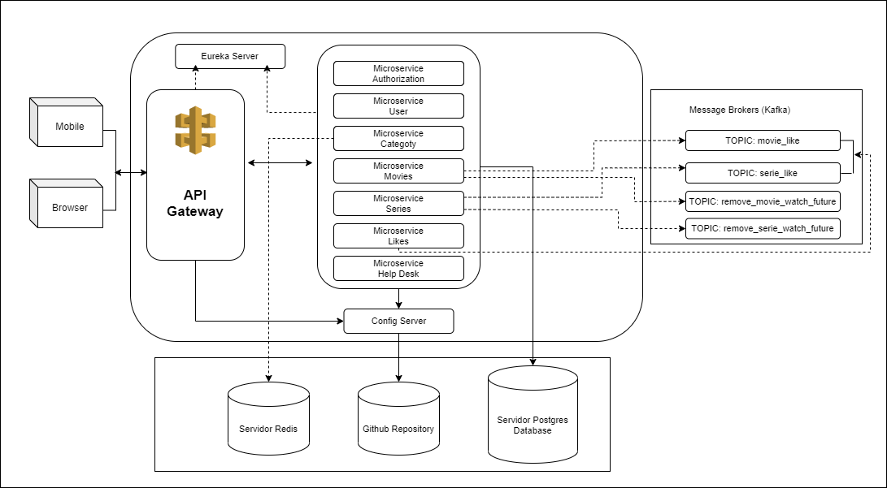
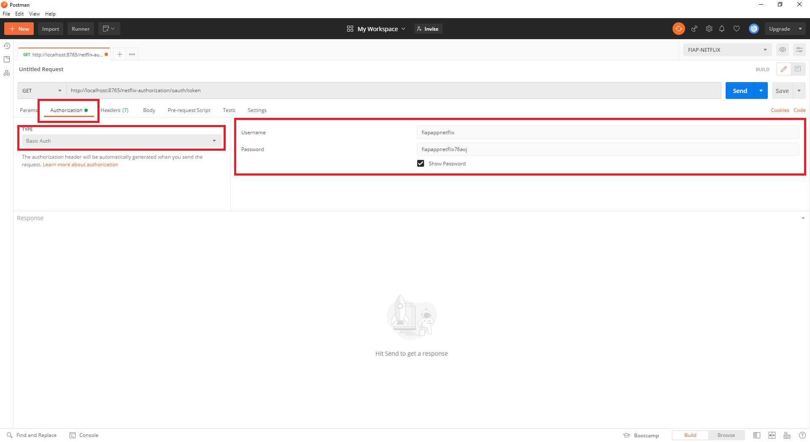
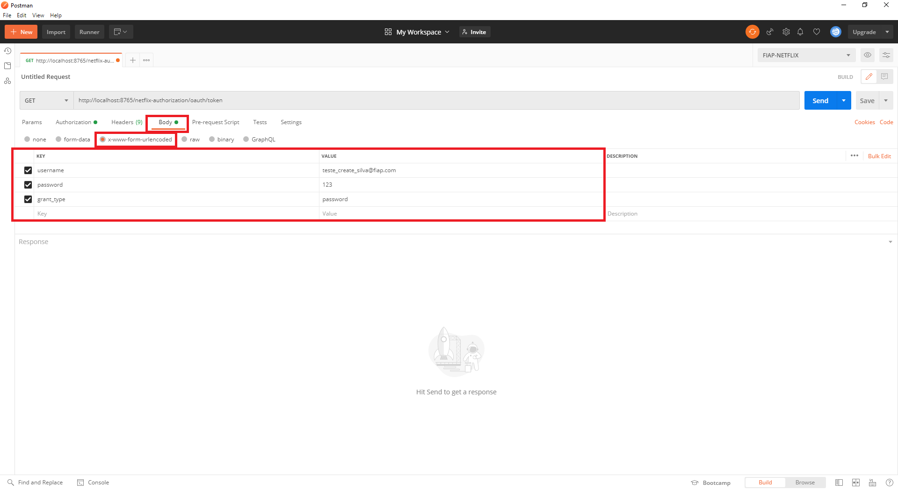
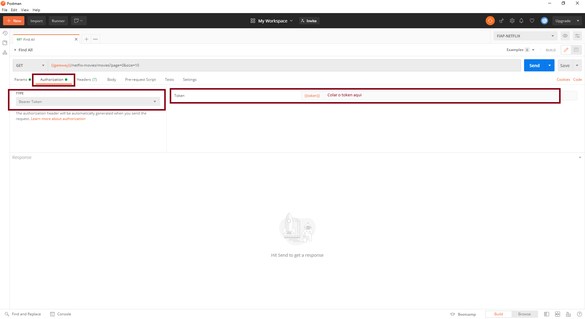

# Projeto Netflix Fiap - 76AOJ

## Index
* [About the project](#about)
* [Solution Architecture Design](#architecture)
* [How to run](#run)


## About the project <a name="about"></a> :link:
Esse projeto consiste no desenvolvimento de algumas funcionalidades do ecossistema da Netflix onde utilizando uma implementação baseada em Microserviços utlizando o `Spring Boot (2.3.7.RELEASE)` como parte da solução, pois o mesmo tem tecnologias e soluções já prontas para serem implementadas.

#### Dominio dos serviços
Nós dividimos o dominio em 7 projetos: `(netflix-user, netflix-authorization, netflix-category, netflix-movies, netflix-series, netflix-likes, netflix-help-desk)`, portanto, em nossas APIs usamos algumas tecnologias e soluções para construir uma arquitetura sólida, segura, rastreável e escalável.

* **Spring Cloud Netflix Eureka:** Usamos o `Netflix Eureka` como uma solução de` Service Discovery` -  que consiste em um dos principais princípios da arquitetura baseada em microservices e o Eureka é o Service Discovery do Netflix que é usado no Server e no Cliente.


* **Spring Cloud Config:** É um micro-serviço onde outros micro-serviços consultam as propriedades da própria aplicação.


* **Spring Cloud OpenFeign:** Foi utilizado para fazer chamadas entre microsserviços de forma simples para seus clientes. Com ele, também podemos usar o Client Side Load Balancer porque o Feign é integrado ao Ribbon, que por sua vez também é integrado ao Eureka.


* **Spring Cloud Sleuth:** Responsável por implementar uma solução de rastreamento distribuído, que nos ajuda a rastrear solicitações entre microsserviços por meio de um ID de correlação, para que possamos rastrear todo o fluxo de uma solicitação que passa vários microsserviços.


* **Netflix Hystrix:** Ele disponibiliza mecanismos para controle de falhas e de lentidão nas chamadas para os serviços, que tornam a aplicação mais resiliente à interrupção de chamadas. Evita, assim, a propagação de falhas para os serviços.


* **Intelligent Routing (Zuul Proxy):** É uma solução de roteamento dinâmico que possibilita monitoramento, resiliência e segurança para aplicações.


* **Spring Cloud OAuth (OAuth2) - Authentication and authorization between microservices:** Configuramos toda a segurança com Spring Security e `Spring Cloud OAuth` e conectamos através de adaptadores de segurança padrão spring com` OAuth2`. O nome de usuário e senha estão na memória para facilitar o teste.

#### Solution Architecture Design <a name="architecture"></a> :link:



## How to run <a name="run"></a> :wrench:
Siga as instruções abaixo para construir e executar o projeto de forma simples e fácil, mas fique à vontade para executá-lo da maneira que desejar.

**Tecnologias:**

* Java 11
* Maven
* PostgreSQL (Recommendo utilizar o Docker)
* Redis
* Zookeeper/Kafka (Recommendo utilizar o Docker)
* Postman for testing
* Zipkin (Recommendo utilizar o Docker)

**Executando a infra da aplicação com Docker (Recomendando):**

- [Download Docker](https://www.docker.com/products/docker-desktop)

Execute o camando abaixo no terminal de sua preferencia:

```
Iniciando as aplicações: `docker-compose up -d --build`   
Parando aplicações: `docker-compose down`   
Visualizando logs: `docker-compose logs -f`   
```

**Build and Run**

Execute os microsserviços seguindo a ordem abaixo:

1. [netflix-config-server](https://github.com/sironAzevedo/fiap-76aoj-netflix/tree/main/netflix-config-server)
2. [netflix-eureka-server](https://github.com/sironAzevedo/fiap-76aoj-netflix/tree/main/netflix-eureka-server)
3. [netflix-user](https://github.com/sironAzevedo/fiap-76aoj-netflix/tree/main/netflix-user)
4. [netflix-authorization](https://github.com/sironAzevedo/fiap-76aoj-netflix/tree/main/netflix-authorization)
5. [netflix-authorization](https://github.com/sironAzevedo/fiap-76aoj-netflix/tree/main/netflix-authorization)
6. [netflix-category](https://github.com/sironAzevedo/fiap-76aoj-netflix/tree/main/netflix-category)
7. [netflix-likes](https://github.com/sironAzevedo/fiap-76aoj-netflix/tree/main/netflix-likes)
8. [netflix-movies](https://github.com/sironAzevedo/fiap-76aoj-netflix/tree/main/netflix-movies)
9. [netflix-series](https://github.com/sironAzevedo/fiap-76aoj-netflix/tree/main/netflix-series)
10. [netflix-help-desk](https://github.com/sironAzevedo/fiap-76aoj-netflix/tree/main/netflix-help-desk)
11. [netflix-netflix-gateway](https://github.com/sironAzevedo/fiap-76aoj-netflix/tree/main/netflix-netflix-gateway)

Fique à vontade para usar seu IDE favorita

Acessar o dashboard do Eureka Server no navegador: `http://localhost:8761/`   
Acessar o dashboard do zipkin no navegador: `http://localhost:9411/`   
Acessando o kafka pela ferramenta [Conductor](https://www.conduktor.io/download/): `http://localhost:9092/`   

url-netflix-config-server: `http://localhost:8888/`   
url-netflix-eureka-server: `http://localhost:8761/eureka`   
url-netflix-netflix-gateway: `http://localhost:8765/`   

#### Acessando as aplicações pelo Postman:

* **Login**

URL: `{{url-netflix-netflix-gateway}}/netflix-authorization/oauth/token`

```

Login Cliente:
Usuario: teste_create_silva@fiap.com
Senha: 123
grant_type: password

Login Aplicação:
Username: fiapappnetflix
Password: fiapappnetflix76aoj

```




**OBS.:** Copiar o conteudo do campo `token` gerado no login e colar na aba de Authorization para realizar as requisições abaixo:   


* **Exemplos de requisição:**

Listar Categorias: `{{url-netflix-netflix-gateway}}/netflix-category/category?page=0&size=5`   
Listar Movies: `{{url-netflix-netflix-gateway}}/netflix-movies/movies?page=0&size=10`    
Like Movie: `{{url-netflix-netflix-gateway}}/netflix-likes/likes/movie?email=teste_create_silva@email.com&movie=1&like=yes`     


* **Acessando a base de dados:**

```
db-netflix-user:
	HOST: localhost
	DATABASE: db_netflix_user
	PORT: 5432
OBS.: Caso já tenha o postgres instalado na maquina, por favor, execute o stop do mesmo para não dar conflito.
	
db-netflix-category:
	HOST: localhost
	DATABASE: db_netflix_category
	PORT: 5433
	
db-netflix-movies:
	HOST: localhost
	DATABASE: db_netflix_movies
	PORT: 5434

db-netflix-series:
	HOST: localhost
	DATABASE: db_netflix_series
	PORT: 5435

db-netflix-help-desk:
	HOST: localhost
	DATABASE: db_netflix_help_desk
	PORT: 5436
```


